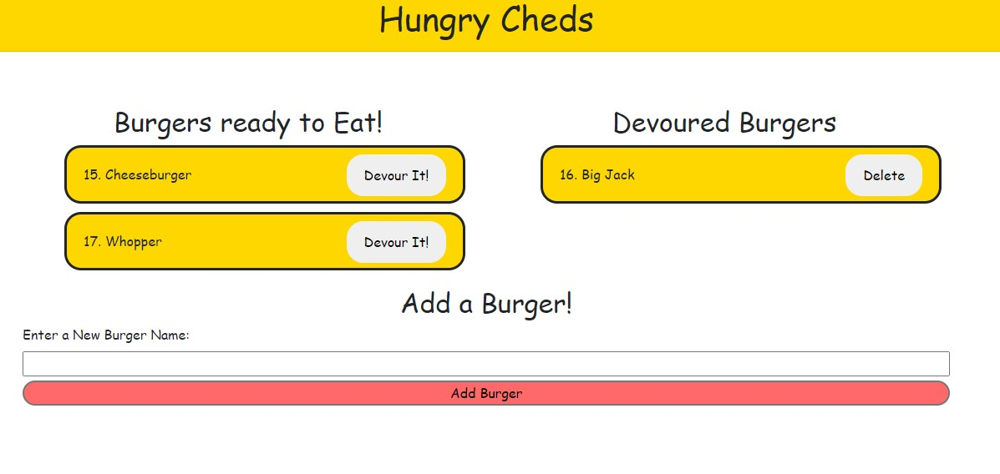

# Eat-Da-Burger
Github Link : https://github.com/ChrisAMK/README-GeneratorGithub 

For this weeks homework we are to create a Burger Logger that uses HTML, CSS, JavaScript, Node and MySQL. The Aim of the Application is to allow to user to enter a burger they would like to eat, that data is then sent to a database then the browser recieves that data from the database and displays it for the user in the Burgers ready to eat section. From there the user can click on the devour button to update a setting in the database that then makes the burger go to the Devoured List of Burgers. From there i added an extra delete function that completely removes the burger from the database. The main takeaway from the activity was stick to the MVC methods to create a application where the code is all connected while still being in separate files, this way the application can be worked on by multiple people and if one component goes haywire, the whole app may not crash.

